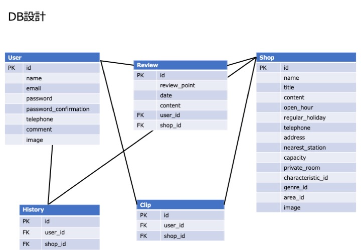

# WORK-SPACE

<b>「フリーランス一人ひとりに快適な作業場所を」</b>

大阪府内にあるカフェやコワーキングスペース、漫画喫茶等 仕事で活用することができる場所を好みの条件に合わせて検索することができます。

以下のURLでアプリを公開中です！ 
https://work-space.me/  

## アプリ概要
- 大阪府内にある作業場所を様々な条件で検索できる 
- 使ったお店の口コミを投稿することができる 
- 行ったお店や気になるお店をマイページで見ることができる  

作成背景や制作に対する想いは以下のURLで記載しております。 
https://qiita.com/jus_37/private/d2d60fa0c0aa239104e7

## 機能

検索機能：エリアやジャンルなど、入力したキーワードに合致するお店が検索可能   
口コミ投稿機能：活用したお店の評価とコメントを投稿することができる  
マイページ機能：行った店舗、お気に入り保存したお店を一覧で見ることができる  
地図確認機能：グーグルマップで作業場所の位置が確認可能  
管理者権限機能：特定の管理者のみ全ユーザーのアカウントや口コミの投稿を削除可能  

## 工夫/意識した点

### 見た目や機能面
・UIUXは誰もが使ったことがあるサイトを参考にして、使いやすさをこだわる 
・ヘッダーに検索フォームを置くことでどのページからでも検索することが可能 
・ゲストユーザー機能によって誰でもお試しで利用可能 
・実際にターゲットに使ってもらえるように店舗データを充実させる（全83件登録） 

### テスト面、その他
・実際のチーム開発を意識したGitHub管理\(Issues, Blanch, Pull Request) 
・RSpecにて単体テストと結合テストを実施し、エラーが出ないことを確認 
・セキュリティとSEO対策よりURLをhttps化 

## DB図

## 使用技術等
言語：Ruby 
フレームワーク：Ruby on Rails 
フロント：Sass, Javascript(JQuery) 
テスト：RSpec 
インフラ：AWS\(AMI, EC2, S3, Route53, ACM, ELB) 
ソースコード管理：GitHub 
その他：Capistranoによる自動デプロイ

## About me

##### 2018 04~ 
大阪大学人間学部卒業後、大手メーカー入社 
本社でマーケターとして企画〜レビューまでPDCAすべてを担当

##### 2020 10~ 
エンジニアとして社会貢献することに魅力を感じて退職 
現在勉強しながらオリジナルアプリ開発中 

連絡先；jus_37@outlook.jp