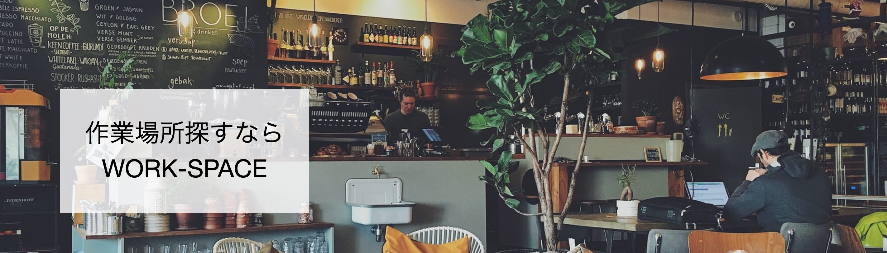

# WORK-SPACE
 

<b>「フリーランス一人ひとりに快適な作業場所を」</b>

大阪府内にあるカフェやコワーキングスペース、漫画喫茶等 仕事で活用することができる場所を好みの条件に合わせて検索することができます。

以下のURLでアプリを公開中です 
https://work-space.me/   

## 💻 アプリ概要
- 大阪府内にある作業場所を様々な条件で検索できる 
- 使ったお店の口コミを投稿することができる 
- 行ったお店や気になるお店をマイページで見ることができる  

作成背景や制作に対する想いは以下のURLで記載しています。 
[ポートフォリオ解説](https://qiita.com/jus_37/private/d2d60fa0c0aa239104e7)  

## 📖 アプリの使い方

下記メールアドレスとパスワードを入力することでログイン可能です。 
\(ゲストログインボタンからでもログイン可能) 
　Email：test@com 
　Password：111111a 
1. トップページでエリア、ジャンル、おすすめポイントのボタンを押すかヘッダーのフォームを入力し、自分の条件にあったお店を一覧で表示。
2. 店舗詳細ページで「行った(口コミを投稿する)」をクリックし、口コミ投稿画面でお店の評価を入力。
3. ヘッダーにある「マイページ」をクリックし、自分が口コミを投稿した店舗一覧やお気に入り保存した店舗一覧を確認。

  

## 🔧 工夫/意識した点

### 見た目や機能面
・GCPを使い、店舗の位置をグーグルマップで表示 
・誰もがひと目見ただけで使うことができるよう、UIUXにこだわる 
・ヘッダーに検索フォームを置くことでどのページからでも検索することが可能 
・ゲストユーザー機能によって誰でもお試しで利用可能 
・実際にターゲットに使ってもらえるように店舗データを充実させる（全83件登録） 
・特定の管理者のみ全ユーザーの口コミやアカウント自身を削除可能

### テスト面、その他
・実際のチーム開発を意識したGitHub管理\(Issues, Blanch, Pull Request) 
・RSpecにて単体テストと結合テストを実施し、エラーが出ないことを確認 
・セキュリティとSEO対策よりURLをhttps化  

## 📝 DB図

  

## 💡 使用技術等
言語：Ruby 
フレームワーク：Ruby on Rails 
フロント：Sass, Javascript(JQuery) 
テスト：RSpec 
インフラ：AWS\(AMI, EC2, S3, Route53, ACM, ELB) 
ソースコード管理：GitHub 
その他：Capistranoによる自動デプロイ  

## 👀 About me

##### 2018 04~ 
大阪大学人間学部卒業後、大手メーカー入社 
本社でマーケターとして企画〜レビューまでPDCAすべてを担当

##### 2020 10~ 
エンジニアとして社会貢献することに魅力を感じて退職 
現在勉強しながらオリジナルアプリ開発中 

連絡先；jus_37@outlook.jp